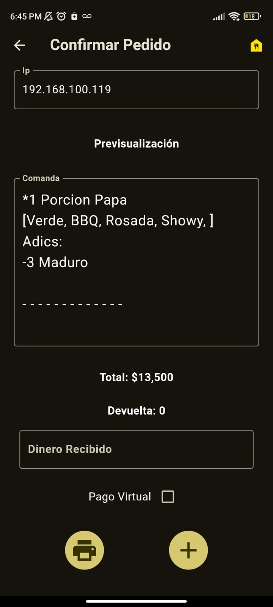
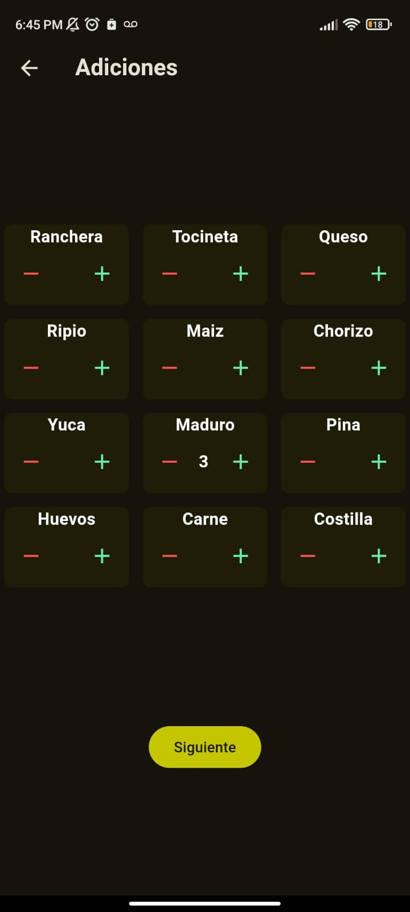
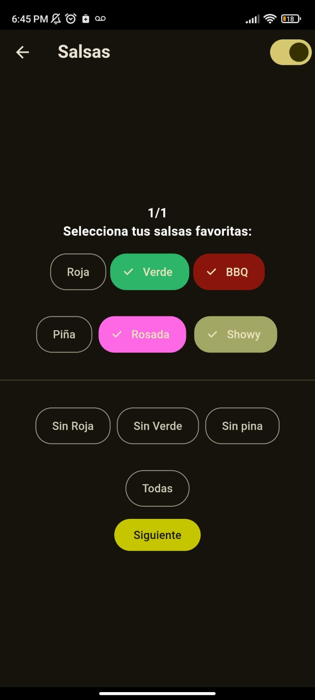
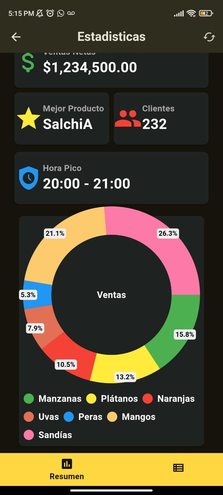

# cw2

# ComandApp

Es una aplicación móvil que permite tomar pedidos de manera ágil, imprimir comandas y generar estadísticas de venta diarias. Está enfocada en restaurantes de comidas rápidas con alta demanda en horas pico. Permite conexión con impresoras térmicas mediante una misma red, edición de productos, adiciones o toppings y categorías. Además, cuenta con la funcionalidad de visualizar el total del pedido y calcular devueltas.

## Capturas de pantalla





## Tecnologías utilizadas

- Dart
- Flutter
- SQLite (para la base de datos local)

La impresora y los dispositivos que usan esta app están conectados a una misma red local, lo que les permite usar e imprimir de manera simultánea.

Ten en cuenta que esta por defecto para impresoras térmicas de 80mm.

La contrasena para configuracion es "1234"

## Instalación y configuración

Para configurar y usar la app debes seguir los siguientes pasos:

```bash
# Clona el repositorio
git clone https://github.com/TU_USUARIO/TU_REPOSITORIO.git

# Entra en el directorio del proyecto
cd TU_REPOSITORIO

# Instala las dependencias
flutter pub get

Edita la dirección IP de tu impresora térmica en lib/screens/confirm.dart en la línea 24:

```Dart
TextEditingController txtIp = TextEditingController(text: '192.168.100.119');

## Getting Started

This project is a starting point for a Flutter application.

A few resources to get you started if this is your first Flutter project:

- [Lab: Write your first Flutter app](https://docs.flutter.dev/get-started/codelab)
- [Cookbook: Useful Flutter samples](https://docs.flutter.dev/cookbook)

For help getting started with Flutter development, view the
[online documentation](https://docs.flutter.dev/), which offers tutorials,
samples, guidance on mobile development, and a full API reference.
